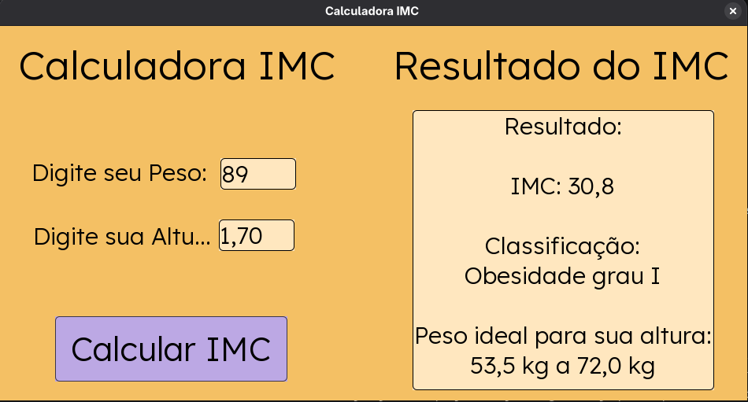

# Calculadora IMC em Java Swing

Projeto de uma calculadora de IMC desenvolvida em Java com interface gráfica utilizando Swing.

## Objetivo

O objetivo deste projeto é praticar conceitos básicos de Java, interface gráfica, eventos, validação de dados e organização de um projeto para portfólio no GitHub.

## Funcionalidades

- Entrada de peso em kg
- Entrada de altura em metros
- Cálculo do IMC
- Classificação do IMC
- Exibição de faixa de peso ideal baseada na altura
- Validação de campos vazios ou inválidos
- Interface gráfica com Java Swing

## Tecnologias utilizadas

- Java
- Java Swing
- AWT

## Como executar

Compile o projeto:

```bash
javac CalculadoraIMC.java helper_classes/*.java
  GNU nano 8.5                      README.md                       Modificado  

- Java
- Java Swing
- AWT

## Como executar

Compile o projeto:

```bash
javac CalculadoraIMC.java helper_classes/*.java
```
Execute o projeto
```bash
java CalculadoraIMC
```
## Interface



